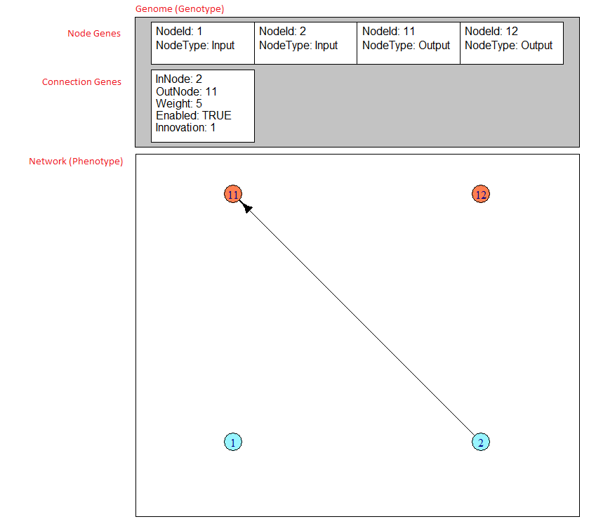
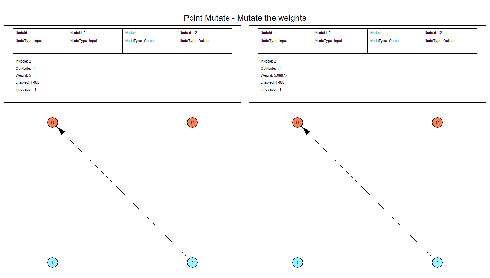
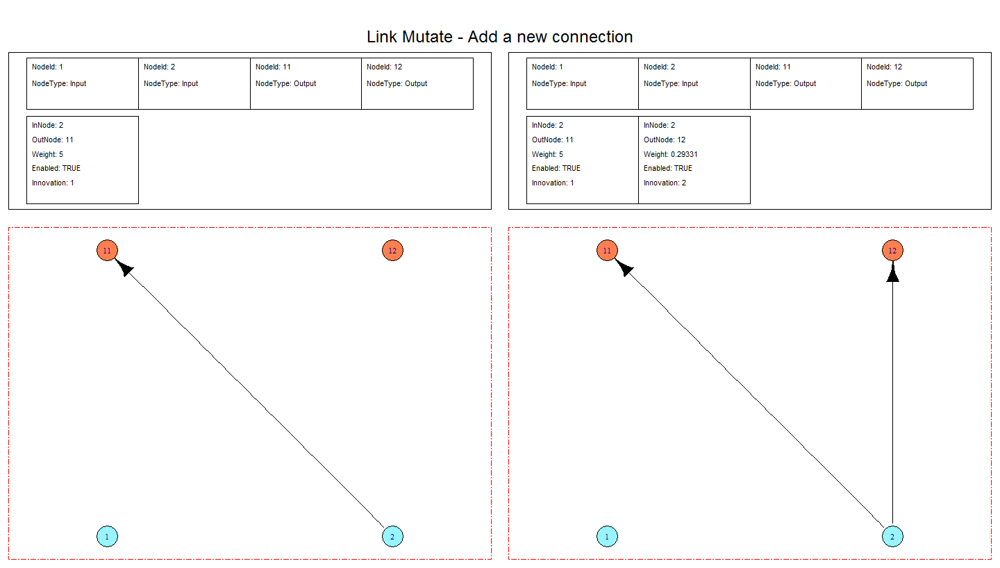
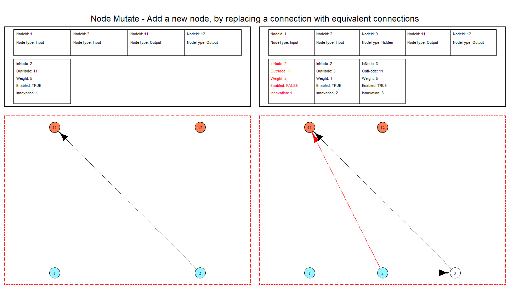
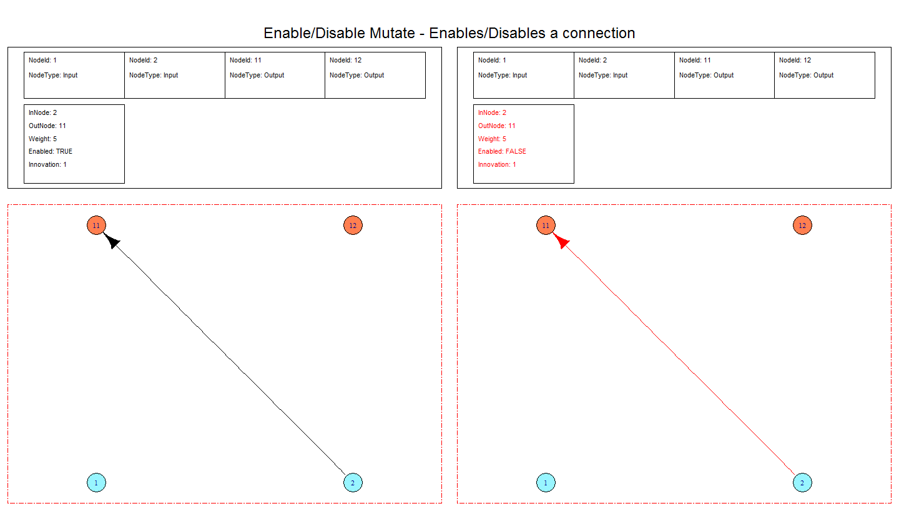
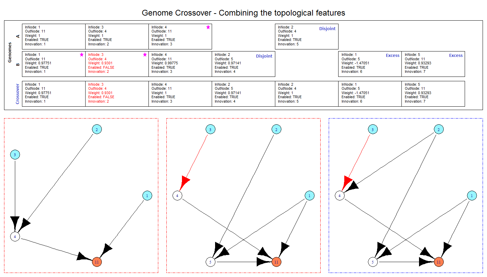

RNeat provides an implementation of the Neuroevolution of Augmenting Topologies algorithm. This is a genetic algorithm for training neural networks which evolves not only the weight space but the topological space too starting from a minimalist structure.

## Overview

The NEAT algorithm aims to develop a genetic algorithm that searching through neural network weight and structure space that has the following properties:

* Have genetic representation that allows structure to be crossed over in a meaningful way
* Protect topological innovations that need a few evolutions to be optimised so that it doesn’t disappear from the gene pool prematurely
* Minimise topologies throughout training without specially contrived network complexity penalisation functions

A through treatment of the algorithm can be found in the paper **Evolving Neural Networks through Augmenting Topologies by Kenneth O. Stanley and Risto Miikkulainen** (http://nn.cs.utexas.edu/downloads/papers/stanley.ec02.pdf).


## Genetic Representation
A genome contains a number of genes, each gene represents a connection between nodes in the neural network. Each node is either an input, hidden or output node. The input nodes take in the state of the system, the hidden nodes are used by the neural network to do calculations and the output is used to update the state / make a decision.



Genes have an input node, an output node, a weight, an enabled/disabled flag and an innovation number. The innovation number is tracking the historical origin of each gene. If two genes have the same innovation number then they must represent the same topology (although the weights may be different). This is exploited during the gene crossover.

## Genome Mutation
The following mutations can happen to the genomes.

### Point Mutate

Randomly updates the weight of a randomly selected connection gene

The updates are either:

New Weight = Old Weight +/- Random number between 0 and genome$MutationRate[[“Step”]]

or

New Weight = Random number between -2 and 2




### Link Mutate

Randomly adds a new connection to the network with a random weight between -2 and 2




### Node Mutate

This mutation adds a new node to the network by disabling a connection, replacing it with a connection of weight 1, a node and a connection with the same weight as the disabled connection. In essence it’s been replaced with an identically functioning equivalent.




### Enable Disable Mutate

Randomly enables and disables connections




## Genome Crossover (Mating)

Genomes crossover takes two parent genomes (lets call them A and B) and creates a new genome (lets call it the child) taking the strongest genes from A and B copying any topological structures along the way.

During the crossover genes from both genomes are lined up using their innovation number. For each innovation number the gene from the most fit parent is selected and inserted into the child genome. If both parent genomes are the same fitness then the gene is randomly selected from either parent with equal probability. If the innovation number is only present in one parent then this is known as a disjoint or excess gene and represents a topological innovation, it too is inserted into the child.

The image below shows the crossover process for two genomes of the same fitness.


<br>
## Speciation

Speciation takes all the genomes in a given genome pool and attempts to split them into distinct groups known as species. The genomes in each species will have similar characteristics.

A way of measuring the similarity between two genomes is required, if two genomes are “similar” they are from the same species. A natural measure to use would be a weighted sum of the number of disjoint & excess genes (representing topological differences) and the difference in weights between matching genes. If the weighted sum is below some threshold then the genomes are of the same species.

The advantage of splitting the genomes into species is that during the genetic evolution step where genomes with low fitness are culled (removed entirely from the genome pool) **rather than having each genome fight for it’s place against every other genome in the entire genome pool we can make it fight for it’s place against genomes of the same species**. This way species that form from a new topological innovation that might not have a high fitness yet due to not having it’s weights optimised will survive the culling.

#Usage
Pole balancing example

```{r,eval=FALSE}

drawPoleFunc <- function(fixedEnd.x,fixedEnd.y,poleLength, theta,
                         fillColour=NA, borderColour="black"){
  floatingEnd.x <- fixedEnd.x-poleLength * sin(theta)
  floatingEnd.y <- fixedEnd.y+poleLength * cos(theta)

  polygon(c(fixedEnd.x,floatingEnd.x,floatingEnd.x,fixedEnd.x),
          c(fixedEnd.y,floatingEnd.y,floatingEnd.y,fixedEnd.y),
          col = fillColour, border=borderColour)
}

drawPendulum <- function(fixedEnd.x,fixedEnd.y,poleLength, theta,
                         radius,fillColour=NA, borderColour="black"){
  floatingEnd.x <- fixedEnd.x-poleLength * sin(theta)
  floatingEnd.y <- fixedEnd.y+poleLength * cos(theta)
  createCircleFunc(floatingEnd.x,floatingEnd.y,radius,fillColour,borderColour)
}

#Parameters to control the simulation
simulation.timestep = 0.005
simulation.gravity = 9.8 #meters per second^2
simulation.numoftimesteps = 2000

pole.length = 1 #meters, total pole length
pole.width = 0.2
pole.theta = pi
pole.thetaDot = 0
pole.thetaDotDot = 0
pole.colour = "purple"


pendulum.centerX = NA
pendulum.centerY = NA
pendulum.radius = 0.1
pendulum.mass = 0.1
pendulum.colour = "purple"

cart.width=0.5
cart.centerX = 0
cart.centerY = 0
cart.height=0.2
cart.colour="red"
cart.centerXDot = 0
cart.centerXDotDot = 0
cart.mass = 0.4
cart.force = 0
cart.mu=2


track.limit= 10 #meters from center
track.x = -track.limit
track.height=0.01
track.y = 0.5*track.height
track.colour = "blue"

leftBuffer.width=0.1
leftBuffer.height=0.2
leftBuffer.x=-track.limit-0.5*cart.width-leftBuffer.width
leftBuffer.y=0.5*leftBuffer.height
leftBuffer.colour = "blue"

rightBuffer.width=0.1
rightBuffer.height=0.2
rightBuffer.x=track.limit+0.5*cart.width
rightBuffer.y=0.5*rightBuffer.height
rightBuffer.colour = "blue"

#Define the size of the scene (used to visualise what is happening in the simulation)
scene.width = 2*max(rightBuffer.x+rightBuffer.width,track.limit+pole.length+pendulum.radius)
scene.bottomLeftX = -0.5*scene.width
scene.height=max(pole.length+pendulum.radius,scene.width)
scene.bottomLeftY = -0.5*scene.height

poleBalance.InitialState <- function(){
  state <- list()
  state[1] <- cart.centerX
  state[2] <- cart.centerXDot
  state[3] <- cart.centerXDotDot
  state[4] <- cart.force
  state[5] <- pole.theta
  state[6] <- pole.thetaDot
  state[7] <- pole.thetaDotDot
  return(state)
}

poleBalance.ConvertStateToNeuralNetInputs <- function(currentState){
  return (currentState)
}

poleBalance.UpdatePoleState <- function(currentState,neuralNetOutputs){
  #print("Updating pole state")
  #print(neuralNetOutputs)
  cart.centerX <- currentState[[1]]
  cart.centerXDot <- currentState[[2]]
  cart.centerXDotDot <- currentState[[3]]
  cart.force <- currentState[[4]]+neuralNetOutputs[[1]]
  pole.theta <- currentState[[5]]
  pole.thetaDot <- currentState[[6]]
  pole.thetaDotDot <- currentState[[7]]

  costheta = cos(pole.theta)
  sintheta = sin(pole.theta)
  totalmass = cart.mass+pendulum.mass
  masslength = pendulum.mass*pole.length

  pole.thetaDotDot = (simulation.gravity*totalmass*sintheta+costheta*
                    (cart.force-masslength*pole.thetaDot^2*sintheta-cart.mu*cart.centerXDot))/
                    (pole.length*(totalmass-pendulum.mass*costheta^2))

  cart.centerXDotDot =(cart.force+masslength*(pole.thetaDotDot*costheta-pole.thetaDot^2*sintheta)-
                      cart.mu*cart.centerXDot)/totalmass

  cart.centerX = cart.centerX+simulation.timestep*cart.centerXDot
  cart.centerXDot = cart.centerXDot+simulation.timestep*cart.centerXDotDot
  pole.theta = (pole.theta +simulation.timestep*pole.thetaDot )
  pole.thetaDot = pole.thetaDot+simulation.timestep*pole.thetaDotDot

  currentState[1] <- cart.centerX
  currentState[2] <- cart.centerXDot
  currentState[3] <- cart.centerXDotDot
  currentState[4] <- cart.force
  currentState[5] <- pole.theta
  currentState[6] <- pole.thetaDot
  currentState[7] <- pole.thetaDotDot
  return (currentState)
}


poleBalance.UpdateFitness <- function(oldState,updatedState,oldFitness){
  #return (oldFitness+1) #fitness is just how long we've ran for
  #return (oldFitness+((track.limit-abs(updatedState[[1]]))/track.limit)^2)
  #More reward for staying near middle of track

  height <- cos(updatedState[[5]]) #is -ve if below track
  heightFitness <- max(height,0)
  centerFitness <- (track.limit-abs(updatedState[[1]]))/track.limit
  return (oldFitness+(heightFitness + heightFitness*centerFitness))
}

poleBalance.CheckForTermination <- function(frameNum,oldState,updatedState,oldFitness,newFitness){
  cart.centerX <- updatedState[[1]]
  cart.centerXDot <- updatedState[[2]]
  cart.centerXDotDot <- updatedState[[3]]
  cart.force <- updatedState[[4]]
  pole.theta <- updatedState[[5]]
  pole.thetaDot <- updatedState[[6]]
  pole.thetaDotDot <- updatedState[[7]]

  oldpole.theta <- oldState[[5]]
  if(frameNum > 20000){
    print("Max Frame Num Exceeded , stopping simulation")
    return (TRUE)
  }

  height <- cos(pole.theta)
  oldHeight <- cos(oldpole.theta)
  if(height==-1 & cart.force==0){
    return(TRUE)
  }

  if(oldHeight >= 0 & height < 0){
    #print("Pole fell over")
    return (TRUE)
  }
  if(cart.centerX < track.x | cart.centerX > (track.x+2*track.limit)){
    #print("Exceeded track length")
    return (TRUE)
  } else {
    return (FALSE)
  }
}

poleBalance.PlotState <-function(updatedState){
  cart.centerX <- updatedState[[1]]
  cart.centerXDot <- updatedState[[2]]
  cart.centerXDotDot <- updatedState[[3]]
  cart.force <- updatedState[[4]]
  pole.theta <- updatedState[[5]]
  pole.thetaDot <- updatedState[[6]]
  pole.thetaDotDot <- updatedState[[7]]

  createSceneFunc(scene.bottomLeftX,scene.bottomLeftY,scene.width,scene.height,
                  main="Simulation of Inverted Pendulum - www.gekkoquant.com",xlab="",
                  ylab="",xlim=c(-0.5*scene.width,0.5*scene.width),
                  ylim=c(-0.5*scene.height,0.5*scene.height))

  createBoxFunc(track.x,track.y,track.limit*2,track.height,track.colour)
  createBoxFunc(leftBuffer.x,leftBuffer.y,leftBuffer.width,leftBuffer.height,leftBuffer.colour)
  createBoxFunc(rightBuffer.x,rightBuffer.y,rightBuffer.width,
                rightBuffer.height,rightBuffer.colour)
  createBoxFunc(cart.centerX-0.5*cart.width,cart.centerY+0.5*cart.height,cart.width,cart.height,
                cart.colour)
  drawPoleFunc(cart.centerX,cart.centerY,2*pole.length,pole.theta,pole.colour)
  drawPendulum(cart.centerX,cart.centerY,2*pole.length,pole.theta,pendulum.radius,pendulum.colour)

}

config <- newConfigNEAT(7,1,500,50)
poleSimulation <- newNEATSimulation(config, poleBalance.InitialState,
                                    poleBalance.UpdatePoleState,
                                    poleBalance.ConvertStateToNeuralNetInputs,
                                    poleBalance.UpdateFitness,
                                    poleBalance.CheckForTermination,
                                    poleBalance.PlotState)

nMax <- 1 #Number of generations to run
for(i in seq(1,nMax)){
  poleSimulation <- NEATSimulation.RunSingleGeneration(poleSimulation)
  #poleSimulation <- NEATSimulation.RunSingleGeneration(poleSimulation,T,"videos",
  #                                            "poleBalance",1/simulation.timestep)
}


```


